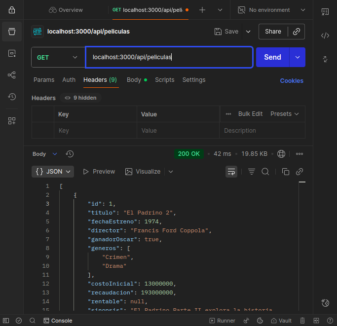
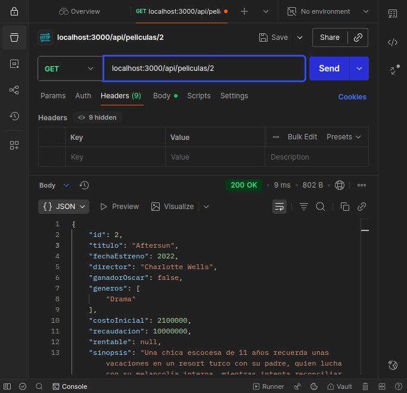
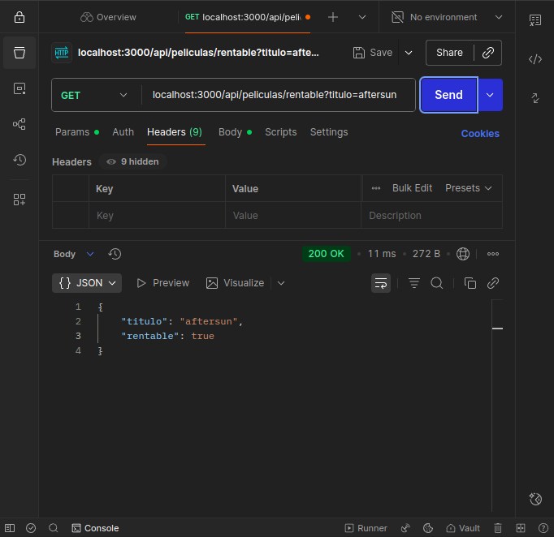
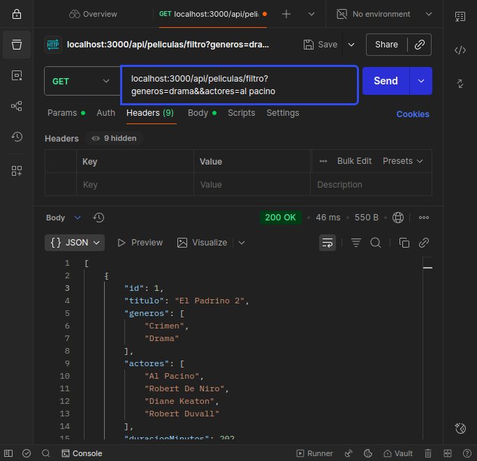
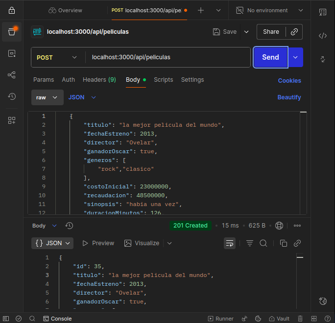
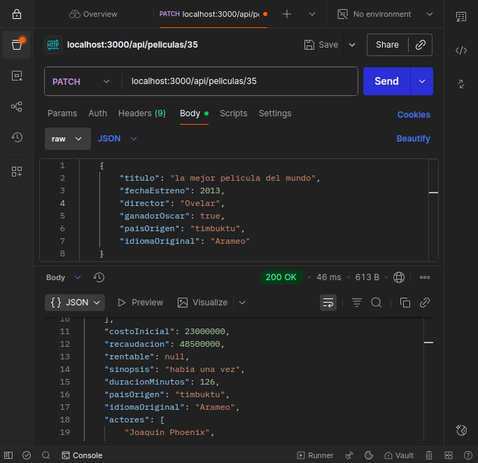
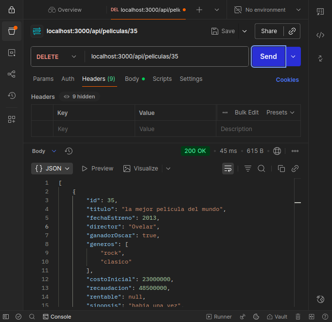

# API REST de Películas 🎬

## Descripción
Esta API REST permite gestionar información sobre películas: creación, lectura, actualización y eliminación.  
Los datos de cada película incluyen:

- Título
- Fecha de Estreno
- Director
- Ganador del Oscar
- Géneros
- Costo Inicial
- Recaudación
- Rentabilidad
- Sinopsis
- Duración
- País de Origen
- Idioma Original
- Actores

La API sigue el patrón MVC y utiliza middlewares para validación y registro de logs.


```bash
📦 API
├── 📁 controlador
│   └── 📄 peliControlador.js
├── 📁 data
│   └── 📄 datosPeliculas.json
├── 📁 middlewares
│   ├── 📄 logger.js
│   ├── 📄 validateData.js
│   └── 📄 logs.txt
├── 📁 vista
│   └── 📄 peliVista.js
├── 📁 modelo
│   └── 📄 peliModelo.js
├── 📄 index.js
├── 📄 package.json
└── 📄 README.md

```

- Controlador : se encarga de recibir las solicitudes y de coordinar el flujo de datos
- Modelo : se encarga del manejo y la lógica de los datos
- Vista : definición de las rutas y el receptor de las solicitudes HTTP
- Middlewares : se ejecuta entre el request y el response

### Base URL http://localhost:3000/api/peliculas

### ENDPOINTS
| Método | Ruta      | Descripción                              | Parámetros / Body                                   |
| ------ | --------- | ---------------------------------------- | --------------------------------------------------- |
| GET    | /         | Lista todas las películas                | Ninguno                                             |
| GET    | /:id      | Obtiene una película por ID              | id (en URL)                                         |
| GET    | /filtro   | Filtra películas por actor o género      | actor o genero (query string)                       |
| GET    | /rentable | Consulta la rentabilidad de una película | titulo (query string)                               |
| POST   | /         | Agrega una nueva película                | { "titulo": "Matrix", "fechaEstreno": 1999 } (Body) |
| PATCH  | /:id      | Actualiza datos de una película          | id (en URL) y body con los campos a actualizar      |
| DELETE | /:id      | Elimina una película                     | id (en URL)                                         |


### Middlewares Implementados
| Middleware         | Descripción                                                        | Momento de ejecución           |
| ------------------ | ------------------------------------------------------------------ | ------------------------------ |
| Logger             | Registra cada petición con fecha y hora, guardándola en `logs.txt` | Antes de llegar al controlador |
| Validador de datos | Verifica que los campos enviados sean correctos y completos        | Antes de llegar al controlador |
| Express JSON       | Permite que la API procese solicitudes en formato JSON             | Antes de llegar al controlador |


### Validaciones
Los campos esperados y que se validan son:

- String: no vacío, no solo números, solo caracteres válidos.
- Integer: números enteros positivos.
- Boolean: debe ser true o false.
- Array: no vacío y con valores correctos.
- Cualquier dato null o undefined es rechazado

### Ejemplos de uso con Postman

```bash
GET localhost:3000/api/peliculas
```



```bash
GET localhost:3000/api/peliculas/2
```


```bash
La propiedad rentable se calcula y se actualiza al momento de de buscar la película
GET localhost:3000/api/rentable?titulo=aftersun
```


```bash
GET localhost:3000/api/peliculas/filtro?generos=drama&&actores=al pacino
```


```bash
POST localhost:3000/api/peliculas
Body (JSON):
Las propiedades ID y rentable se agregan después de hacer el POST
{
  "titulo": "Inception",
  "fechaEstreno": 2010,
  "director": "Christopher Nolan",
  "ganadorOscar": true,
  "generos": ["Ciencia ficción", "Acción"],
  "costoInicial": 160000000,
  "recaudacion": 830000000,
  "sinopsis": "Un ladrón roba secretos entrando en los sueños de las personas.",
  "duracionMinutos": 148,
  "paisOrigen": "Estados Unidos",
  "idiomaOriginal": "Inglés",
  "actores": ["Leonardo DiCaprio", "Elliot Page"]
}

```


```bash
PATCH localhost:3000/api/peliculas/35
```


```bash
delete localhost:3000/api/peliculas/35
```



## 🛠️ Tecnologías utilizadas
- Node.js
- Express.js
- Middleware personalizado (logger, validador)
- JSON como fuente de datos
- Postman para pruebas

## 🚀 Cómo ejecutar el proyecto
1️⃣ Clonar el repositorio

```bash
git clone https://github.com/ovelar-C/API-de-las-Mejores-Pel-culas-Del-Mundo.git
```
2️⃣ Instalar dependencias
```bash
npm install
```
3️⃣ Iniciar el servidor
```bash
node index.js

```

### Conclusión 
- Este proyecto representó un gran aprendizaje en la implementación de APIs REST con Node.js y Express, aplicando el patrón MVC, validaciones, middlewares y pruebas con Postman. En este proceso se consolidaron conceptos clave de estructura y comunicación entre cliente y servidor.
